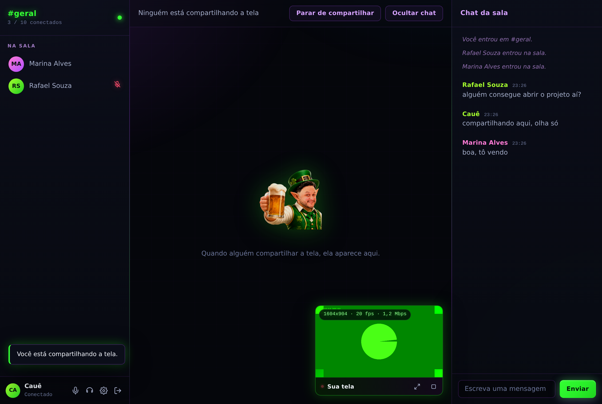

# PinduCcall

App nativo de Windows para voz, compartilhamento de tela e chat, com o servidor
rodando no seu próprio PC. Até 10 pessoas na mesma sala, sem serviço de terceiros
no meio: o áudio e o vídeo passam pela sua máquina e por mais ninguém.



---

## O que tem pronto

- **Voz** para até 10 pessoas, com indicador de quem está falando, mudo, "silenciar tudo" e push-to-talk na barra de espaço.
- **Compartilhamento de tela** de um monitor inteiro ou de uma janela específica, com o **som do sistema** junto (som do jogo, do vídeo, do que estiver tocando).
- **Prévia da própria tela** com monitoramento ao vivo: você vê exatamente o que está transmitindo, com resolução, quadros por segundo e banda em uso.
- **Arquivos no chat**: documento, imagem ou zip por arrastar-e-soltar, apagados sozinhos em 24 horas.
- **Salas que se limpam sozinhas**: uma sala vazia por 24 horas é apagada com chat, timers e convites — o servidor não vira um cemitério de salas.
- **Convite por link**: um clique gera o link, quem recebe entra direto na sala sem digitar senha.
- **Chat de texto** com histórico salvo no PC do host — quem entra depois vê o que já foi conversado.
- **Várias salas no mesmo servidor**, cada uma com senha própria: cada turma abre a sua, e a tela de entrada lista as salas com quantas pessoas tem em cada uma. Limite de 10 pessoas por sala.
- **Painel do Tibia**: timers de hunt sincronizados, modo DJ e split de loot — na coluna da direita, com o chat logo abaixo.


## Como está organizado

```
teamlink/
├── server/     O SFU (Node.js + mediasoup) e a landing page em public/
├── client/     O app Windows que todo mundo instala (Electron)
├── REDE.md     Como deixar a sala acessível pela internet
└── LEIA-ME.md  Este arquivo
```

O servidor é um **SFU** (Selective Forwarding Unit): cada pessoa envia sua voz e
sua tela uma única vez para o seu PC, e ele redistribui para os demais. É o mesmo
desenho que o Discord usa, e é o que permite chegar a 10 pessoas sem que o upload
de cada participante exploda — numa malha P2P, cada um teria que enviar nove
cópias de tudo.

---

## Instalação

### 1. No seu PC (o host)

Você precisa do [Node.js 20 ou mais novo](https://nodejs.org) (baixe a versão LTS,
instalador padrão, next-next-finish).

```
1. Abra a pasta server/
2. Dê dois cliques em iniciar-servidor.bat
```

Na primeira vez ele baixa as dependências (alguns minutos) e cria o arquivo
`.env`. **Abra o `.env` e troque a `ROOM_PASSWORD`** antes de convidar alguém.

Depois, clique com o botão direito em `liberar-firewall.ps1` → *Executar com o
PowerShell*, para abrir as portas no Firewall do Windows.

Deixe a janela preta do servidor aberta enquanto a sala estiver em uso.

### 2. Gerar o app para você e seus amigos

```bash
cd client
npm install
npm run dist
```

O instalador aparece em `client/release/`:

- `PinduCcall-1.7.6-x64.exe` — instalador normal
- `PinduCcall-1.7.6-x64.exe` (portable) — versão que roda sem instalar

Mande esse arquivo para as pessoas. Elas **não** precisam de Node.js nem de nada
além do app.

Se quiser distribuir por link em vez de mandar o arquivo, copie os dois `.exe`
para `server/public/download/` com estes nomes:

```
PinduCcall-Setup.exe      (instalador)
PinduCcall-Portable.exe   (versão portátil)
```

A landing page em `http://ENDEREÇO-DO-SERVIDOR:4000/` já aponta para eles. É só
mandar o link — quem controla quem entra no servidor é você, decidindo para quem
manda esse endereço.

### 3. Entrar na sala

Cada pessoa abre o PinduCcall, escreve o **nome**, escolhe uma **sala na lista** e
digita a **senha daquela sala**. O endereço do servidor já vem embutido no app —
ninguém precisa saber IP.

### Salas

O servidor guarda um catálogo de salas em `data/salas.json`. Cada sala tem senha
própria, gravada como `scrypt` + salt (nunca em texto puro), e sobrevive a
reinicializações.

A lista mostra o nome da sala e quantas pessoas estão dentro agora. Ver o nome
não dá acesso: a senha continua sendo exigida.

Para criar uma sala, a pessoa clica em **Criar uma sala nova** e escolhe nome e
senha. Ela entra na sala recém-criada na hora. Quem controla quem pode criar
sala é você, decidindo para quem manda o instalador — o servidor só limita o
total de salas (`MAX_ROOMS`, 30 por padrão).

### Arquivos no chat

Dá para mandar documento, imagem, planilha, PDF, zip — arrastando em cima do
chat ou pelo clipe ao lado do campo de mensagem. Quem recebe vê um cartão com
nome, tamanho e prazo, e o botão **Baixar** abre o download no navegador.

| | |
|---|---|
| Limite por arquivo | 25 MB (`ARQUIVO_MAX_MB`) |
| Validade | 24 horas (`ARQUIVO_HORAS`) — depois some do disco |
| Teto por sala | 300 MB (`ARQUIVO_SALA_MB`) |
| Teto do servidor | 3 GB (`ARQUIVO_TOTAL_MB`) |

**Programas e scripts são recusados** (`.exe`, `.bat`, `.ps1`, `.jar`, `.apk` e
companhia). Não é antivírus: é para a sala não virar um canal cômodo de espalhar
executável entre os amigos. O download sempre sai como anexo, com tipo genérico,
para nada ser executado pelo navegador de quem baixa.

O envio em si vai por HTTP, não pelo WebSocket — o servidor devolve uma
autorização de uso único e o app manda os bytes por fora, com barra de progresso.
Quem anuncia no chat é o servidor, depois que o arquivo chegou inteiro.

### Salas que se limpam sozinhas

Uma sala criada pelo aplicativo é apagada **24 horas depois que a última pessoa
sai** (`SALA_EXPIRA_HORAS` no `.env`). Some tudo junto: o histórico de chat, os
timers e os links de convite dela. Enquanto tiver alguém dentro, o relógio fica
parado — só começa a contar quando a sala esvazia.

A **sala padrão** (a do `ROOM_PASSWORD`, `geral` por padrão) é a exceção: ela é
marcada como fixa e nunca expira, porque é a sala da casa e a senha dela mora no
`.env`. Na tela de entrada, passar o mouse sobre uma sala vazia mostra quanto
tempo falta para ela sumir.

### Convidar por link

Dentro da sala tem o botão **Convidar**. Ele gera um link do tipo
`http://SEU-ENDEREÇO:4000/c/<token>` e já copia para a área de transferência.

Quem clicar no link:

- **tem o app** — ele abre direto na sala, sem digitar senha. Se for a primeira
  vez, aparece só um popup pedindo o nome;
- **não tem o app** — cai numa página que explica o convite e leva ao download.

O link vale **24 horas** (`CONVITE_HORAS` no `.env`) e serve para quantas pessoas
você quiser. Clicar em Convidar de novo devolve o mesmo link enquanto ele estiver
valendo, então dá para mandar uma vez só no grupo. Ele abre **uma sala só** — não
dá acesso ao resto do servidor.

Por baixo, o link usa o protocolo `pinduccall://`, registrado pelo instalador. É
por isso que o Windows pode perguntar uma vez se pode abrir o PinduCcall.

Quem quiser apontar o app para outro servidor clica no endereço no rodapé da tela
de entrada. Pela internet, leia o **[REDE.md](REDE.md)** — ele explica as opções
e por que Cloudflare Tunnel sozinho não resolve.

---

## Usando

| Ação | Como |
|---|---|
| Mudo / desmudo | Botão do microfone, ou **Ctrl+Shift+M** de qualquer lugar do Windows |
| Push-to-talk | Estando mudo e com a janela em foco, segure a **barra de espaço** |
| Silenciar tudo | Botão do fone (também muta seu microfone, como no Discord) |
| Compartilhar tela | Botão *Compartilhar tela* → escolha monitor ou janela → *Compartilhar* |
| Ver sua própria tela | A prévia aparece sozinha no canto do palco quando você começa a compartilhar |
| Ampliar uma tela | Clique na miniatura de quem está compartilhando; clique de novo para voltar |
| Trocar microfone | Engrenagem → *Microfone* (vale na hora, sem reconectar) |

O seletor de qualidade no momento de compartilhar vai de 720p30 (leve) a 1440p30
(pesado). Se sua internet ou a dos convidados estiver sofrendo, 720p30 resolve
quase sempre.

### A prévia da própria tela

Assim que você começa a compartilhar, uma janelinha aparece no canto do palco
com o que está sendo transmitido. O vídeo dela vem direto da captura local, sem
passar pelo servidor — então é o que a sua máquina está enviando, sem atraso de
ida e volta.

O texto sobre o vídeo é monitoramento de verdade, lido a cada 2 segundos das
estatísticas do WebRTC:

```
1920x1080 · 30 fps · 3,4 Mbps
```

Isso é o que **efetivamente sai** da sua máquina, não o que você escolheu no
seletor. Se a rede apertar e o WebRTC baixar a resolução ou os quadros sozinho,
você vê acontecer ali — é o jeito mais rápido de descobrir que a transmissão
está sofrendo antes de alguém reclamar.

Os dois botões da barrinha ampliam a prévia e param o compartilhamento.

---

## O painel do Tibia

Fica no topo da coluna da direita, com o chat embaixo. Três abas.

### ⏳ Timers da hunt

Um clica, conta para **todos**. O servidor guarda o estado e avisa a sala pelo
WebSocket que já está aberto — a mudança aparece na hora, sem link separado e
sem ficar perguntando de tempos em tempos como no overlay antigo.

A sala já nasce com o **Mastermind Potion** de 10 minutos, repetindo. Ele não
pode ser removido; os que você criar podem.

| | |
|---|---|
| Criar | Nome, minutos, segundos e 🔁 se for para repetir sozinho |
| Iniciar / parar | O ▶ do timer — vale para a sala inteira |
| Alarme | Toca em todo mundo no mesmo instante, e a barra de tarefas pisca |
| Aviso antecipado | Um bipe discreto X segundos antes de acabar (só para você) |
| Volume | Individual — cada um regula o seu |

Sobre relógio: o servidor manda junto o horário **dele**, e cada app calcula a
diferença para o próprio relógio uma vez. Assim ninguém fica adiantado por causa
do relógio do Windows desregulado.

### 🎵 Modo DJ

Uma pessoa assume o comando e toca música do próprio PC — todo mundo ouve pela
call, junto com a voz.

1. Clique em **Assumir a música**
2. **Escolher músicas** e selecione os MP3 (pode marcar vários de uma vez)
3. ▶ ⏸ ⏹ ⏭ ⏮ controlam a fila

**Os botões valem para todos.** Quem não é o DJ também pode apertar pular: o
comando viaja pela sala e é executado no PC de quem está com a música. Quem
estiver ouvindo vê o nome da faixa e o equalizador se mexendo.

Dois volumes separados, porque servem a coisas diferentes: **volume na call** é
o que os outros ouvem, e **volume só pra você** é o seu monitor local. Dá para
deixar a música baixinha no seu fone e alta para a galera, ou o contrário.

A música vai numa faixa de áudio própria (estéreo, 128 kbps, sem corte de
silêncio) — separada do microfone, então ela não é cortada quando você fala.

### 💰 Split de loot

Cole o log do **Party Hunt Analyser** (o texto do botão *Copy* dentro do Tibia)
e clique em Calcular. Sai quem paga quem, no menor número de transferências
possível, com o botão 📋 copiando o `transfer X to Fulano` pronto para colar no
jogo. **Mandar no chat** publica o resultado para a sala toda.

O algoritmo é o mesmo do bot: soma o balance de todos, divide pelo número de
players e faz quem ficou acima da média pagar quem ficou abaixo.

---

## Testando: sozinho e com um amigo

### Sozinho, no mesmo PC

Por padrão o PinduCcall abre uma janela só — clicar no ícone de novo apenas foca a
janela existente. Para testar fazendo o papel de duas pessoas, abra a segunda
cópia com um perfil separado:

```powershell
# Perfil descartável, um por execução
PinduCcall.exe --multi

# Perfil nomeado, guarda as próprias preferências
PinduCcall.exe --profile=teste
```

O nome do perfil aparece no título da janela, para você não se confundir. Cada
perfil tem preferências próprias, e o atalho global Ctrl+Shift+M continua valendo
só para a janela principal (dois apps não podem registrar o mesmo atalho do
sistema).

Um detalhe esperado: com as duas janelas no mesmo PC, o áudio de uma entra pelo
microfone da outra e vira microfonia. Use fone, ou deixe uma das duas no mudo —
para testar tela e chat funciona perfeitamente.

### Com um amigo

O caminho mais rápido, em cinco minutos:

1. **Você**: deixe o servidor rodando (`iniciar-servidor.bat`) e rode o `liberar-firewall.ps1` uma vez.
2. **Você**: instale o [Tailscale](https://tailscale.com/download/windows), entre com uma conta e pegue seu IP com `tailscale ip -4` (começa com `100.`).
3. **Você**: ponha esse IP em `ANNOUNCED_IP` no `server/.env` e **reinicie o servidor**.
4. **Seu amigo**: instala o Tailscale e aceita seu convite (no painel do Tailscale, em *Users* → *Invite external users*, ou compartilhando o dispositivo).
5. **Seu amigo**: você manda o `PinduCcall-1.7.6-x64.exe` (a versão portable roda sem instalar) — ele abre e preenche:
   - Se o servidor dele não for o oficial, clica no endereço no rodapé e põe `ws://SEU-IP-TAILSCALE:4000/ws`
   - Escolhe a sala na lista
   - Senha: a daquela sala

**Se vocês estiverem na mesma casa/escritório** (mesmo Wi-Fi), pule o Tailscale
inteiro: passe só o IP local (`ipconfig` mostra, tipo `192.168.0.15`) e ele usa
`ws://192.168.0.15:4000/ws`.

**Como saber se está tudo certo antes de chamar alguém:** peça para seu amigo
abrir `http://SEU-ENDEREÇO:4000/health` no navegador. Se aparecer um JSON com
`"status": "ok"`, o caminho até você funciona e ele consegue entrar.

## Se algo der errado

**"Não foi possível conectar"**
O servidor não está no ar, o endereço está errado ou o firewall está bloqueando.
Teste abrindo `http://ENDEREÇO-DO-HOST:4000/health` no navegador: se não abrir, o
problema é de rede, não do app.

**Entrei na sala e o chat funciona, mas ninguém se ouve**
Sintoma clássico de mídia bloqueada: a sinalização (TCP 4000) passa, mas as portas
de mídia (UDP 40000-40100) não. Veja a seção de testes do [REDE.md](REDE.md).

**"Senha da sala incorreta"**
Cada sala tem a sua. Confira se você clicou na sala certa na lista antes de
digitar. A senha da sala `geral` é a `ROOM_PASSWORD` que estava no `.env` quando o
servidor subiu pela primeira vez; as demais foram definidas por quem criou a sala.

**O Tibia aparece preto — ou sumiu da lista de janelas**

> **A resposta curta:** ligue a **Câmera Virtual** no OBS e escolha ela na aba
> *Câmera / OBS* do PinduCcall. Não existe jeito de capturar a janela direto.

O cliente do Tibia marca a própria janela com a trava de cópia do Windows
(`SetWindowDisplayAffinity` / `WDA_MONITOR`). Isso foi medido nesta máquina, não
deduzido: com a trava ligada, a cópia da área de trabalho inteira sai preta, o
`PrintWindow` sai preto e o `BitBlt` sai preto. Rode `teste-de-captura.bat` para
ver as imagens, e `monitor-trava.bat` para acompanhar a trava ao vivo.

**Trocar o motor gráfico não resolve mais.** Testamos DirectX 5, DirectX 9 e
OpenGL: a trava está ligada em todos. Era a saída antiga, e deixou de funcionar.

Por que Discord e OBS conseguem: eles **injetam uma DLL dentro do processo do
jogo** e copiam o quadro antes de ele virar imagem na tela — está escrito na
documentação do Discord. O PinduCcall não faz isso e não vai fazer: carregar
código nosso dentro do cliente do Tibia é exatamente o que a Cipsoft trata como
programa de terceiros, e a conta em risco seria a de quem usa.

A ponte, então, é a **câmera virtual**: quem captura o jogo é o OBS, que você já
usa e já confia; ele publica o resultado como uma câmera comum; e o PinduCcall
transmite essa câmera. Ninguém precisa mexer por dentro do jogo.

Modo manual (funciona sempre):

1. No OBS, monte a cena com o jogo (Game Capture) e clique em **Iniciar Câmera Virtual**
2. No PinduCcall: *Compartilhar tela* → aba **Câmera / OBS** → escolha a câmera virtual
3. O som do computador continua indo junto, capturado à parte

Modo automático (o usuário não abre o OBS):

O PinduCcall abre o OBS minimizado na bandeja, monta a cena do Tibia e liga a
câmera virtual sozinho — o usuário só clica em **Ligar o Tibia automático** na aba
*Câmera / OBS*. Para isso, uma vez só, cada máquina precisa de:

- **OBS Studio instalado** (o app procura ele nos caminhos padrão);
- o **Servidor WebSocket do OBS ligado**: no OBS, *Ferramentas → Configurações do
  Servidor WebSocket → Ativar*, anote a porta (padrão 4455) e a senha;
- a mesma porta e senha repetidas no PinduCcall, em *Configurações → OBS
  automático*.

Feito isso, é um clique. Por baixo, o PinduCcall conversa com o OBS pelo
`obs-websocket` e reaproveita exatamente o mesmo gancho de captura que o Discord
usa — sem o PinduCcall injetar nada por conta própria no jogo.

**A janela de outro jogo aparece preta para os outros**
Jogo em **tela cheia exclusiva** desenha direto na placa de vídeo, e o Windows
não consegue entregar essa imagem para captura — sai um retângulo preto. Duas
saídas, nessa ordem: coloque o jogo em **janela sem bordas** (*borderless* /
*windowed fullscreen*, não *fullscreen*), ou compartilhe a **tela inteira** pela
aba *Telas* em vez da janela. O app avisa antes: janela que o Windows não
consegue ler ganha a etiqueta **"pode ir preto"** na hora de escolher.

Se persistir mesmo em janela, é provável que o jogo esteja rodando numa placa de
vídeo diferente da do PinduCcall. Em *Configurações do Windows → Sistema → Vídeo
→ Gráficos*, deixe os dois no mesmo adaptador.

**A tela compartilhada vai sem som**
Só o Windows tem captura de som do sistema (loopback). Além disso, algumas fontes
não oferecem áudio; compartilhar o **monitor inteiro** costuma funcionar melhor do
que compartilhar uma janela isolada.

**O vídeo está travando**
Baixe a qualidade para 720p30, reduza `MAX_INCOMING_BITRATE` no `.env` do servidor
ou combine de só uma pessoa compartilhar por vez. A tabela de banda está no
[REDE.md](REDE.md).

---

## Desenvolvimento

```bash
# Servidor com reload automático
cd server && npm run dev

# App com DevTools aberto
cd client && npm run dev

# Recompilar o renderer enquanto edita
cd client && npm run watch:renderer
```

### Testes

O projeto vem com quatro suítes que rodam de verdade — sobem o servidor,
abrem navegadores e o próprio Electron, e conferem inclusive se os pacotes RTP
atravessaram o SFU.

```bash
cd server && npm run smoke         # sinalização, chat, timers, modo DJ       (120 checagens)
cd client && npm run test:media    # WebRTC + música do DJ atravessando o SFU (15 checagens)
cd client && npm run test:ui       # interface, tela, timers, split e DJ      (107 checagens)
cd client && npm run test:electron # processo principal, IPC, captura, perfis (36 checagens)
```

No Linux, os testes de Electron precisam de um display virtual:
`xvfb-run -a npm run test:electron`.

### Como as peças conversam

```
   App (Electron)                        Servidor (seu PC)
   ─────────────                         ─────────────────
   renderer/src/app.js  ── UI
        │
   room-client.js  ──── WebSocket ────►  signaling.js
        │              (entrar, chat)         │
        │                                     ▼
        │                                  room.js  ── sala, participantes, chat
        │                                     │
        └────────────── WebRTC ───────────►  mediasoup  ── redistribui voz e tela
                       (voz e tela)
```

O protocolo de sinalização está documentado em `server/src/lib/rpc.js`: três
tipos de mensagem (`req`, `res`, `notify`) em JSON, sem framework no meio.

---

## Decisões técnicas

**Por que SFU e não P2P?** Com 10 pessoas em malha P2P, cada participante enviaria
9 cópias do próprio áudio e da própria tela — o upload de todo mundo estouraria.
Com SFU, cada um envia uma vez só; o custo se concentra no upload do host, que é
justamente a máquina que você controla.

**Por que Electron?** É o que dá acesso ao WebRTC completo e à captura de tela com
áudio do sistema no Windows sem escrever código nativo. É o mesmo caminho do
Discord. O preço é o consumo de memória, que fica em torno de 200 MB.

**Por que simulcast no compartilhamento de tela?** Cada pessoa transmite três
qualidades ao mesmo tempo. Quem está com internet ruim recebe a camada menor sem
forçar todo mundo a cair de resolução.

**Segurança:** o renderer roda com `contextIsolation` ligado e sem acesso ao
Node.js — tudo passa por uma ponte de funções nomeadas em `electron/preload.js`.
A mídia WebRTC é criptografada com DTLS-SRTP por padrão. A senha da sala só vai
para o disco se você marcar "lembrar", e é comparada em tempo constante no
servidor.
